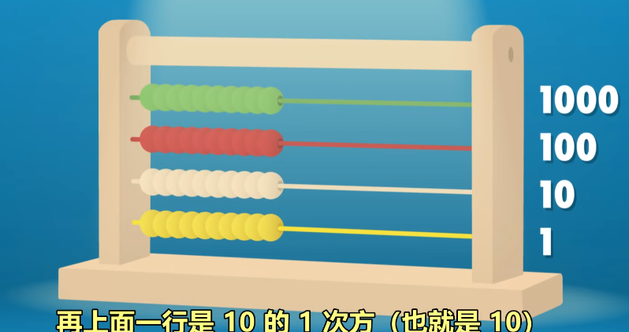
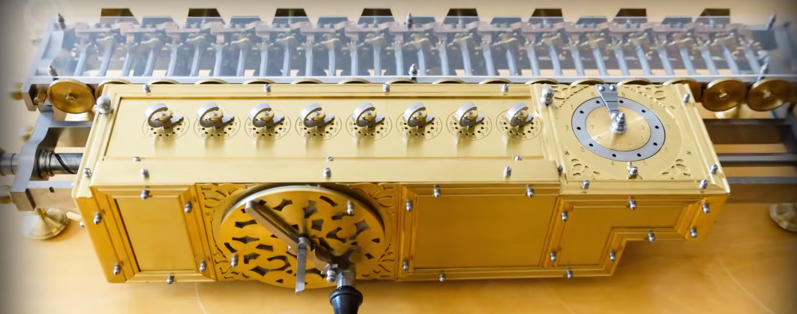
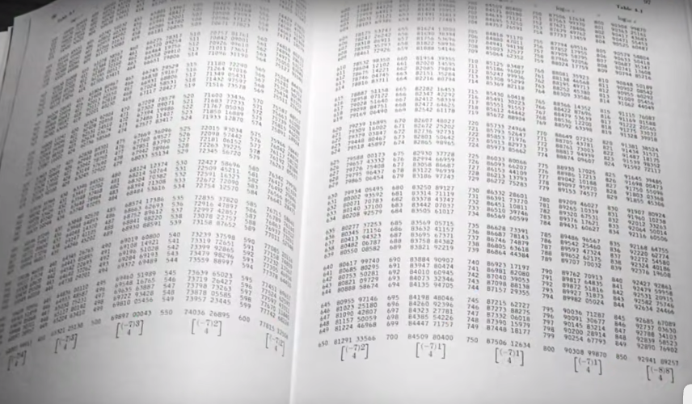
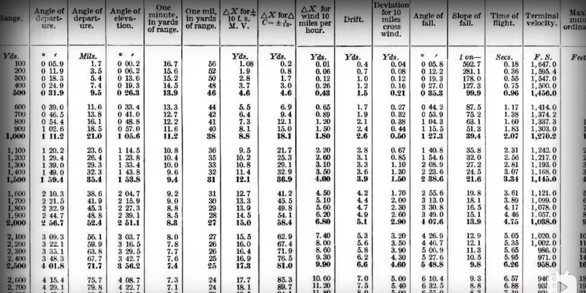
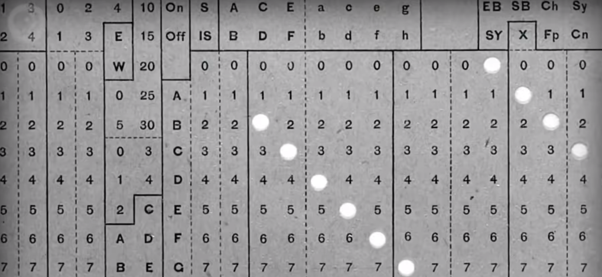

early computing
========================
# 前言引入 
## 计算机早期历史/视频导读
   提到的设备: 算盘-->步进计算器-->差分机-->分析机-->打孔卡片制表机；

提到的人名: Charles Babbage, Ada Lovelace；

最早的计算设备是算盘。举例如何使用；

Computer从指代职业变成指代机器；

机器里有名的是:步进计算器。第个可以做加喊乘除的机器；

炮弹为了精准。要计算弹道二战是查表来做但每次改设计了就需要做一张新表；

Charles Babbage提出了罗差分机器在构造差给机期间。想出了分析机，分析机是通用计算机；

Lovelace给分析机写了假想程序。因站为于第一位程序员；

人口普查10年-次.HermamHollerth的打机卡片制表机大大提升了效率；

* 在这个系列中，我们会学习**Bits(位)**,**Bytes(字节)**，**(transistors)晶体管**，**(logic gates)逻辑门**，一直到 **OperatingSystems(操作系统)**， **Virtual Reality(虚拟现实)** 和**Robots(机器人)**。

* Overthe courseofthisseries, welregoingto gofrom **bits, bytes, transistors and logic gates,alltheway to OperatingSystems, Virtual Reality and Robots!**

## 小节
* 公认最早的计算设备是**算盘**。
* The earliest recognized device for computing was the **abacus**,

* **步进计算器**：它有一连串可以转动的齿轮，每个齿轮有十个齿，代表数字0到9，每当-一个齿轮转过9，官会转回0。同时让旁边的齿轮前进1个齿。

* **the Step Reckoner**：The device had a series of gears that turned;each gear had ten teeth, to represent the digits from 0 to 9.Whenevera gear bypassed nine, it rotated back to 0 andadvanced the adjacent gear by one tooth.

* **人力计算器**：这些手工制作的步进计算器非常昂贵,大部分人买不起,所以会用预先算好的计算表,这些计算表由之前说的“人力计算器”编撰。

* **应用**：射程表(Range Table)

* **human computers**：these hand-crafted machines like the Step Reckoner were expensive, and not accessible to most of the population.so people experienced computing through pre-computed tables assembledby thoseamazing "human computers" we talkedabout.

* **分析机**：分析机是"通用计算机”，可以做很多事情，不只是一种特定运算，甚至可以给它数据，然后按顺序执行一系列操作，它有内存，甚至一个很原始的打印机。这种 **"自动计算机"的概念** ，计算机可以自动完成一系列操作，是个跨时代的概念，预示着计算机程序的诞生。

* **the Analytical Engine**：the Analyfical Engine was a general purpose computer.It could be usedlformany things,not just onerparticular computation;it could be given data and run operations in sequence;it had memory and even a primitive printer.the idea of an"automaticicomputer",one that could quide itself through a series of roperations automatically,was a huge deal, and would foreshadow computer programs.

* **作用**：分析机激励了第一代计算机科学家,这些计算机科学家,把很多Charles Babbage的点子融入到他们的机器,所以Charles Babbage经常被认为是“计算之父”。

* **effection**：The Analytical Engine would inspire, arguably, the first generation of computer scientists,who incorporated many of Babbage's ideas in their machines.This is why Babbage is often considered the "father of computing".

* **人口普查问题**：1890年的人口普查,预计要13年完成。但人口普查是10年一次!

* **Census Questions**：It was predicted that the 1890 census would take 13 years to compute.That's a lttle problematic when itisrequiredeverydecade!

* **人口普查解决办法**：人口普查局找了Herman Hollerth，他发明了打孔卡片制表机，他的机器是"电动机械的"。Hollerith的机器用打孔卡，一种纸卡，上面有网格，用打孔来表示数据。当卡插入Hollerith的机器时，**小金属针会点到卡片上**,如果有个地方**已打孔了,针会穿过孔泡入一小瓶汞，联通电路**,

* **Census Solutions**：The Census bureau turned to Herman Hollerith, who had built a tabulating machine.His machine was "electro-mechanical".Hollerith's machine used punch cards,which were paper cards with a grid of locations that can be punched out to represent data.then when the card was inserted into Hollerith's machine, **lttle metal pins would come down over the card**,if **a spot was punched out**, the **pin would pass through the hole** in the paper and into a little vial of mercury, which **completed the circuit**.

