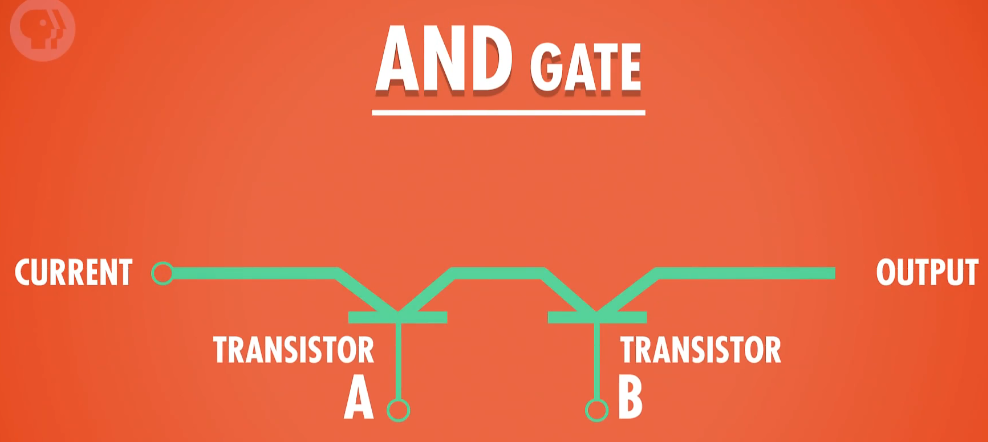
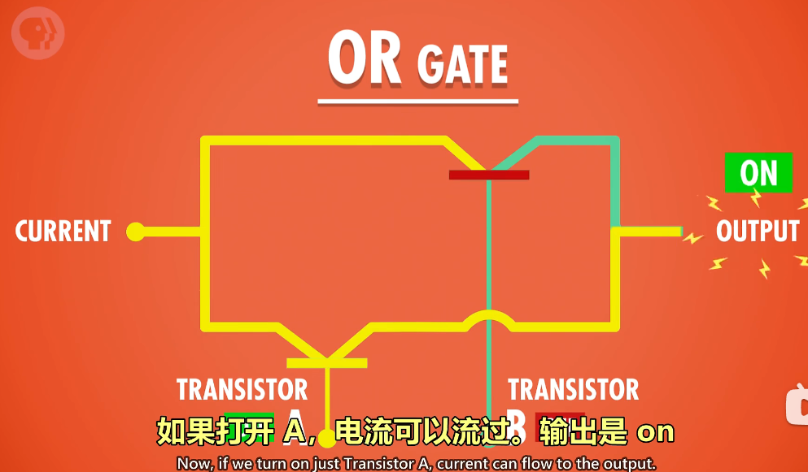
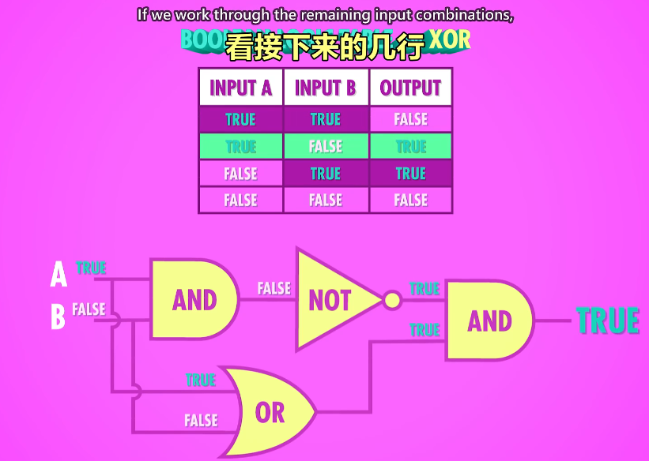
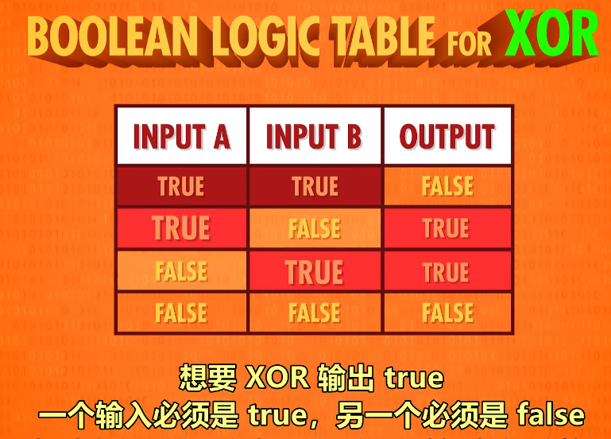

Electronic computing
========================

## 电子计算机/视频导读

## Equipment mentioned: relay, vacuum tube and transistor

**提到的设备:继电器一真空管一晶体管**

20世纪的发展要求更强的计算能力。柜子大小的计算机发展到房间大小

哈佛Mark 1号。IBM 1944年制作

继电器，继电器-秒最多50次开关

继电器出bug

1904年，热电子管出现，第-个真空管。改进后变成和继电器的功能一样

“巨人1号"计算机在英国布莱切利园首次大规模使用真空管。但编程麻烦。还要配置

1946年，宾多法尼亚大学的ENIAC是第-个通用可编程计算机

1947年，贝尔实验室做出了晶体管。晶体管有诸多好处。IBM很狭全面转向晶体管

硅谷的典故:很多晶体管和半导体的开发都是这里做的。而生产半导体最常见的材料是硅

肖克利半导体一仙童半导体→英特尔
## 小节

* **哈佛Mark 1号**：这台机器的大脑是"继电器”,继电器是:用电控制的机械开关,当电流流过线圈，线圈产生电磁场,吸引金属臂。从而闭合电路,不幸的是,继电器内的机械臂*有质量*。

* **Howard Mark 1**：The brains of these huge electro-mechanical beasts were relays: electrically-controlled mechanical switches,When current flows through the coil, an electromagnetic field is created,which in turn, atracts a metal arm inside the relay.snapping it shut and completing the circuit.Unfortunately, the mechanical arm inside of a relay has **mass**.

* **热电子管**：把两个电极装在一个气密的玻璃灯泡里,这是世上第一个真空管,其中一个电极可以加热，从而发射电子,这叫"热电子发射",另一个电极会吸引电子，形成"电龙头"的电流,但只有带正电才行,如果带负电荷或中性电荷,电子就没办法被吸引,越过真空区域.

* **thermionic valve**：which housed two electrodes inside an airtight glass bulb,this was the first vacuum tube,One of the electrodes could be heated, which would cause it to emit electrons, a process called thermionic emission,The other electrode could then attract these electrons to create the flow of our electric faucet,but only if it was positively charged,if it had a negative or neutral charge, the electrons would no longer be attracted across the Vacuum.

* **二极管**：使电流只能单向流动的电子部件,但我们需要的是,一个能开关电流的东西,美国发明家"李德富雷斯特他在“弗莱明"设计的两个电极之间,加入了第三个"控制”电极,该热电子管和继电器的功能一样,但重要的是,真空管内没有会动的组件,这意味着更少的磨损,更重要的是，每秒可以开闭数干次,因此这些 **"三极真空管"** 成为了无线电，长途电话。

* **diode**：An electronic component that permits the one-way flow of current,but what was really needed was a switch to help turn this flow on and off,Anerican inventor Lee de Forest,added a third "control" electrode that sits between the two electrodes in Fleming's design.It's pretty much the same thing as a relay,but importantly, vacuum tubes have no moving parts,this meant there was less wear,and more importantly, they could switch thousands of times per second,These **triode vacuum tubes** would become the basis of radio, long distance telephone.

* **电子数值积分计算机"ENIAC"**：这是世上第一个真正的通用，可编程，电子计算机,ENIAC每秒可执行5000次十位数加减法,使用真空管制作.

* **ENIAC**：Enter the The Electronic Numerical Integrator and Calculator - or ENIAC -,this was the world's first truly general purpose, programmable, electronic computer.ENIAC could perform 5000 ten-digit additions or subtractions per second, made by triode vacuum tubes.

* **晶体管的发展背景**：到1950年代，真空管计算机都达到了极限,为了降低成本和大小,同时提高可靠性和速度,我们需要一种新的电子开关,1947年，贝尔实验室科学家发明了晶体管,一个全新的计算机时代诞生了!晶体管的物理学相当复杂,牵扯到量子力学,所以我们这里基础。

* **Transistor's Development background**：By the 1950s, even vacuum-tube-based computing was reaching its limits.To reduce cost and size,as well as improve reliability and speed,a radical new electronic switch would be needed. In 1947, Bell Laboratory scientists invented the transistor,and with it a whole new era of computing was born!The physics behind transistors is pretty complex, relying on quantum mechanics,so we're going to stick to the basics.

* **晶体管**：晶体管就像之前提过的"继电器"或”真空管”，它是一个开关，可以用控制线路来控制开或关,晶体管有两个电极,电极之间有一种材料隔开它们，这种材料有时候导电,有时候不导电,又叫 **"半导体"**,控制线连到一个"门”电极,通过改变"门”的电荷,我们可以控制半导体材料的导电性,来允许或不允许电流流动.贝尔实验室的第一个晶体管就展示了巨大的潜力,每秒可以开关10,000次,而且，比起玻璃制成，小心易碎的真空管,晶体管是固态的,且晶体管可以远远小于继电器或真空管。生产半导体最常见的材料是"硅",很多晶体管和半导体的开发在”圣克拉拉谷",这个地方在加州。位于产旧金山"和"圣荷西"之间,所以这个地区被称为"硅谷".

* **Transistor**：A transistor is just like a relay or vacuum tube,it's a switch that can be opened or closed by applying electrical power via a control wire,Typically, transistors have two electrodes separated by a material that sometimes can conduct electricity,and other times resist it,a **semiconductor**.In this case, the control wire attaches to a "gate" electrode.By changing the electrical charge of the gate,the conductivity of the semiconducting material can be manipulated,allowing current to flow or be stopped.Even the very first transistor at Bell Labs showed tremendous promise,it could switch between on and off states 10,000 times per second.Further, unlike vacuum tubes made of glass and with carefully suspended, fragile components,transistors were solid material known as a solid state component,Almost immediately, transistors could be made smaller than the smallest possible relays or vacuum tubes.As the most common material used to create semiconductors is silicon,a lotof this transistor and semiconductor development happened in the Santa Clara valley between San Francisco and San Jose, California,so this region soon became known as Silicon valley.

